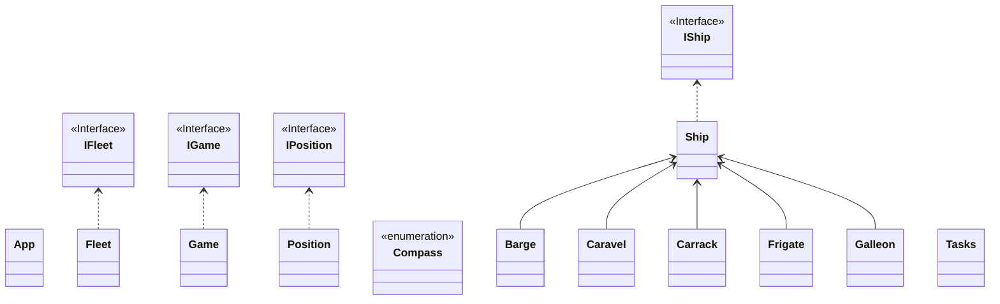

# Documentação da Arquitetura do Projeto

Este documento apresenta a estrutura de classes e a análise arquitetural do sistema de jogo de combate naval.

---

## 1. Diagrama de Classes

O diagrama abaixo utiliza a sintaxe Mermaid e é renderizado graficamente em plataformas compatíveis (ex.: GitHub, VS Code, Obsidian, Notion).

---

## 2. Visão Geral da Arquitetura

O sistema adota os princípios fundamentais da **Programação Orientada a Objetos (POO)** e boas práticas dos princípios **SOLID**, focando-se em alta coesão, baixo acoplamento e facilidade de extensão.

### 2.1. Abstração e Desacoplamento (Interfaces)
O núcleo do desenho baseia-se em abstrações contratuais explícitas:
* **`IGame` e `Game`**: Isolam a interface do motor de jogo dos detalhes internos da sua execução.
* **`IFleet` e `Fleet`**: Definem as operações sobre o conjunto de navios de um jogador (inserção, remoção, integridade da frota).
* **`IShip` e `Ship`**: Estabelecem o comportamento exigido a qualquer embarcação (obter tamanho, verificar estado de integridade, validar coordenadas ocupadas).
* **`IPosition` e `Position`**: Desacoplam a representação e operações de coordenadas espaciais.

> **Princípio da Inversão de Dependência (DIP):** Ao programar contra interfaces (`..>`), as classes dependem de abstrações e não de implementações concretas, permitindo a fácil introdução de testes unitários com *mocks* e maior flexibilidade estrutural.

---

### 2.2. Modelo de Domínio e Polimorfismo (Navios)
A modelação das embarcações foi concebida sob uma hierarquia de herança:
* **Classe Abstrata / Base (`Ship`)**: Implementa a interface `IShip` e centraliza o estado partilhado (ex.: coordenadas, direção, contagem de danos) e métodos comuns.
* **Especializações Concretas (`Barge`, `Caravel`, `Carrack`, `Frigate`, `Galleon`)**:
  * Cada tipo herda (`-->`) de `Ship`.
  * Define características próprias, tais como dimensões, forma geométrica de ocupação na grelha e capacidade de resistência.
* **Princípio Aberto/Fechado (OCP) e Substituição de Liskov (LSP)**: É possível adicionar novos tipos de navios sem alterar o motor do jogo ou a frota, bastando derivar de `Ship` e cumprir o contrato de `IShip`.

---

### 2.3. Modelação Espacial e Orientação
* **`IPosition` / `Position`**: Encapsula as coordenadas $(x, y)$ na grelha do tabuleiro. Centraliza a validação de limites e a comparação de proximidade.
* **`Compass` (`<<enumeration>>`)**: Enumeração que modela as direções cardeais (Norte, Sul, Este, Oeste). Garante consistência tipográfica ao orientar os navios a partir da sua posição de âncora/referência.

---

### 2.4. Orquestração e Execução
* **`Fleet`**: Responsável pela coleção de embarcações de cada interveniente, garantindo que não ocorrem sobreposições ilegais e avaliando se todos os navios foram afundados.
* **`Game`**: Atua como o controlador principal (Controlador de Domínio / Game Loop), gerindo os turnos dos jogadores, regras de ataque, validação de jogadas e determinação das condições de vitória.
* **`App`**: Ponto de entrada (`main`) da aplicação, responsável por instanciar os serviços e inicializar o ciclo de vida do jogo.
* **`Tasks`**: Componente auxiliar de coordenação (ex.: processamento de comandos, agendamento de tarefas ou interações com a consola/UI).