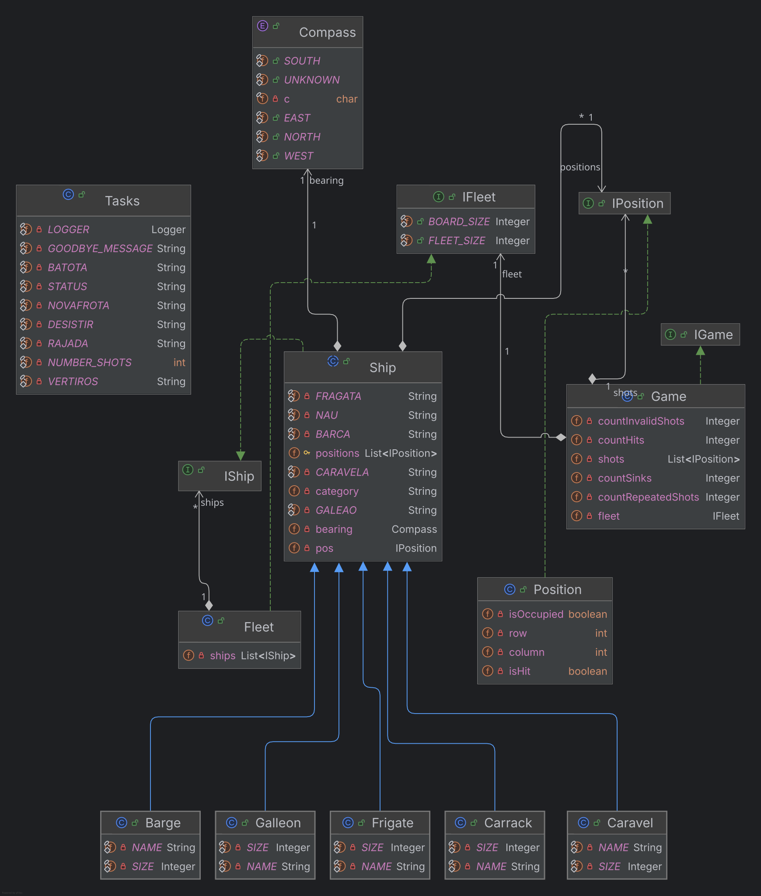

# Documentação da Arquitetura do Projeto

Este documento apresenta a estrutura de classes e a análise arquitetural do sistema de jogo de combate naval.

---

## 1. Diagrama de Classes

---

## 2. Visão Geral da Arquitetura

O sistema está organizado segundo os princípios da **Programação Orientada a Objetos (POO)**, recorrendo a interfaces e herança para estruturar o domínio. A extensão do modelo é possível, embora alguns pontos da implementação exijam alterações quando se adicionam novos tipos de navios.

### 2.1. Abstração e Desacoplamento (Interfaces)
O sistema define interfaces para separar contratos de algumas das suas implementações:
* **`IGame` e `Game`**: Definem as operações de jogo disponíveis, como processar disparos e consultar estatísticas.
* **`IFleet` e `Fleet`**: Definem operações sobre a coleção de navios, como adicionar navios e consultar os que ainda flutuam.
* **`IShip` e `Ship`**: Estabelecem o contrato comum das embarcações, incluindo a consulta das posições ocupadas e do seu estado.
* **`IPosition` e `Position`**: Abstraem as coordenadas e o estado de ocupação e de acerto de cada posição.

Esta utilização de interfaces aplica parcialmente o **Princípio da Inversão de Dependência (DIP)**: por exemplo, `Game` recebe uma `IFleet` e `Fleet` trabalha com objetos `IShip`. O desacoplamento não é completo: `Ship.buildShip` seleciona diretamente as classes concretas de navios, e há outras referências a implementações concretas. As interfaces permitem substituir algumas dependências por implementações alternativas, o que pode facilitar testes com *mocks*.

---

### 2.2. Modelo de Domínio e Polimorfismo (Navios)
A modelação das embarcações foi concebida sob uma hierarquia de herança:
* **Classe Abstrata / Base (`Ship`)**: Implementa a interface `IShip` e centraliza o estado partilhado (categoria, posição de referência, orientação e posições ocupadas), bem como o comportamento comum. O estado de cada acerto é mantido nos objetos `Position` que representam as posições do navio.
* **Especializações Concretas (`Barge`, `Caravel`, `Carrack`, `Frigate`, `Galleon`)**:
  * Cada tipo herda (`-->`) de `Ship`.
  * Define o tamanho e as posições que ocupa na grelha, incluindo formas específicas, como a do galeão.
* **Extensibilidade:** O polimorfismo permite que a frota e o jogo trabalhem com navios através do contrato `IShip`. Contudo, adicionar um novo tipo implica também atualizar a fábrica `Ship.buildShip` e, se necessário, a listagem de categorias em `Fleet`. Assim, a implementação ainda não permite estender os tipos de navio sem modificar código existente.

---

### 2.3. Modelação Espacial e Orientação
* **`IPosition` / `Position`**: Encapsula as coordenadas (linha e coluna), a ocupação e os acertos numa posição. Implementa a comparação de coordenadas e a verificação de adjacência. A validação dos limites do tabuleiro é feita por `Fleet` e `Game`.
* **`Compass` (`<<enumeration>>`)**: Enumeração que representa as direções cardeais (Norte, Sul, Este e Oeste), além do valor `UNKNOWN`. É usada para orientar os navios relativamente à sua posição de referência.

---

### 2.4. Orquestração e Execução
* **`Fleet`**: Mantém uma coleção de navios, valida se cada navio cabe no tabuleiro e evita proximidade entre navios segundo as regras implementadas. Também permite consultar os navios ainda a flutuar.
* **`Game`**: Processa disparos contra uma frota, verifica as coordenadas segundo os limites definidos na implementação, identifica disparos repetidos e regista estatísticas de acertos e navios afundados. Não gere turnos nem jogadores.
* **`Tasks`**: Implementa tarefas de interação pela consola: lê comandos e dados, cria frotas e, na tarefa de combate, coordena rondas de disparos através de `Game`.
* **`App`**: Ponto de entrada (`main`) da aplicação. Apresenta o título e inicia atualmente `Tasks.taskB`, dedicada à construção e consulta do estado de uma frota.